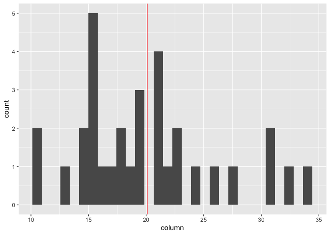

<!-- README.md is generated from README.Rmd. Please edit that file -->

# hist.with.mean

<!-- badges: start -->
<!-- badges: end -->

The goal of hist.with.mean is to create a histogram with a neat little
red line denoting the position of the mean within the distribution.

## Installation

hist.with.mean is not yet on CRAN, but you can download it from this
repository using the following R command:

``` r
devtools::install_github("salihinsubhan/hist.with.mean")
```

## Example

This is a basic example which shows you how to solve a common problem:

``` r
library(hist.with.mean)

data(mtcars) #load the mtcars in-built dataset

histredline(mtcars, mpg)
#> `stat_bin()` using `bins = 30`. Pick better value with `binwidth`.
```



This package is special because it helps you create a ggplot histogram
AND a vertical mean line with just one line of code! So convenient :)
